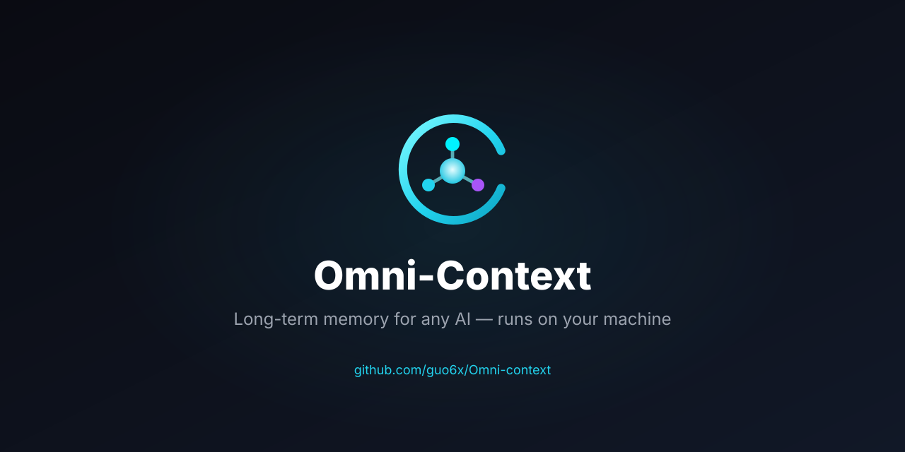

# Omni-Context

<p align="center"><a href="README.md">English</a> · <strong>简体中文</strong></p>

> **通过 MCP 给任何 AI 客户端接入长期记忆。不只是存储——一个会找出你的盲区、挑战你认知的第二大脑。全程本地，永远属于你。**

<p align="center">
  
</p>

[](https://github.com/guo6x/Omni-context/actions)
[](./LICENSE)

<p align="center">
  <a href="https://github.com/guo6x/Omni-context/releases/latest"><strong>下载 Windows 版</strong></a> ·
  <a href="#工作原理">工作原理</a> ·
  <a href="https://guo6x.github.io/Omni-context/">介绍页</a>
</p>

> **产品基线状态** — `17dc1d0` 是产品集成分支 `product/omni-v3-unified-r1` 的**工程起点**：**不是**正式实验冻结产品，原 Targeted-7 门禁**失败**，当前 selector **无正式性能证明**。详见 [docs/PRODUCT-BASELINE.md](docs/PRODUCT-BASELINE.md) 与 [docs/tag-remediation-proposal.md](docs/tag-remediation-proposal.md)。


---

## 为什么需要 Omni-Context

**你的 AI 每次对话都把你忘干净了。** ChatGPT 的记忆很浅，Cursor 的上下文只活一个会话，Claude 跨项目不记得你。

**云端记忆意味着把第二大脑放在别人的服务器上。** Mem0、Letta、Zep —— 都很出色，但都云优先。你的第二大脑跑在他们的基础设施上。

**Omni-Context 给每一个兼容 MCP 的 AI 一个共享、持久、跑在你自己机器上的知识图谱。** 把它接入 Claude Desktop、Cursor、Cline、Windsurf —— 它们都从同一个大脑取记忆。图谱随你的工作不断生长，永远属于你。

**不止是记忆存储。** 大多数"AI 记忆"工具只是高级数据库。Omni-Context 会主动分析你的知识图谱来发现缺口——你反复浏览却从未行动的主题、缺失的视角、没注意到的关联。它不只是存储，是一个会拷问你的第二大脑。

---

## 工作原理

```
你捕获任何东西            我们构建知识图谱              任何 AI 客户端都能查询
───────────────         ──────────────────           ──────────────────────
屏幕 · 文件 · 网页        实体 + 关系                   通过 MCP（标准协议）
浏览器扩展               + 向量 + 全文检索              Claude · Cursor · Cline · …
                        存入本地 SQLite               12+ 客户端，同一个大脑
```

1. **捕获** —— 截图、拖入文件、剪藏网页，或按一个物理按钮。任何东西都行。
2. **抽取** —— OCR + LLM 流水线把实体及其关系抽取进本地知识图谱。
3. **查询** —— 任何兼容 MCP 的 AI 客户端都能把你的图谱当作长期记忆来访问。同一个大脑，贯穿每次对话。

---

## 它有什么不一样

- **不是笔记应用** —— 它是 AI 的记忆层。你的工具不需要各自的记忆系统，它们共享 Omni。
- **不是云端** —— 数据存在你硬盘上的 SQLite 里。无需账号、无服务器，数据永不离开你的机器。
- **不绑定单一 AI** —— 原生 MCP。今天用 Claude Desktop，明天换 Cursor，记忆照旧。
- **主动而非被动** —— 智能体会主动扫描你的图谱，找出你已经遗忘的关联并主动浮现。
- **会质疑你的认知** —— 盲区检测告诉你漏了什么，反共识洞见挑战你的已有假设。你的图谱会反问你。

---

## 安装

### Windows

从 [Releases](https://github.com/guo6x/Omni-context/releases/latest) 下载 `Omni-Context-Setup-x64.msi`，双击即可。完全离线 —— 已内置 Node.js 运行时和嵌入模型。

### macOS / Linux

构建脚本已就绪。有相应硬件的社区贡献者，欢迎提 PR。

### 从源码构建

```bash
git clone https://github.com/guo6x/Omni-context.git
cd Omni-context
npm run install:all
npm run package
```

---

## Omni 与其他方案对比

|                    | Omni | ChatGPT Memory | Mem0 | Letta | Obsidian |
|--------------------|------|----------------|------|-------|----------|
| 本地运行           | ✓    | ✗              | ✗    | ✓     | ✓        |
| 原生 MCP           | ✓    | ✗              | ✗    | ✗     | ✗        |
| 知识图谱           | ✓    | ✗              | 部分 | ✓     | 手动     |
| 跨 AI 共享         | ✓    | ✗              | ✓    | ✗     | ✗        |
| 数据归你所有       | ✓    | ✗              | ✗    | ✓     | ✓        |
| 离线优先           | ✓    | ✗              | ✗    | ✗     | ✓        |

---

## 社区

- [Issues](https://github.com/guo6x/Omni-context/issues) —— Bug、功能需求
- [Discussions](https://github.com/guo6x/Omni-context/discussions) —— 想法、问答
- [参与贡献](./docs/BUILDING.md) —— 开发环境搭建、架构概览

---

MIT 许可证。为想让 AI 真正了解自己的人而造。
